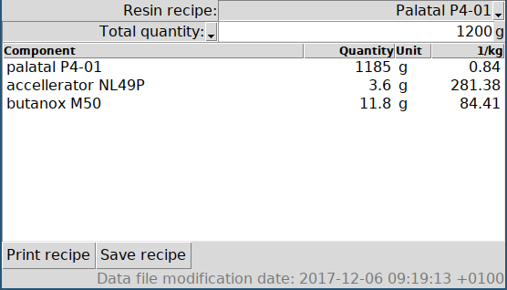

Resin calculator
################

:date: 2017-12-21
:tags: python, composites, bonding
:author: Roland Smith

.. Last modified: 2020-10-27T18:38:25+0100

Introduction
------------

This repository contains the ``resin-calculator`` program. This is a Python
3 program using the Tkinter GUI toolkit to calculate the amount of components
for resins or adhesives.

Requirements
------------

The following software is required:

* Python 3.6 or later
* Tkinter (can be included with Python)
* ttk (might be included in Tkinter)

Installation
------------

To install it for the local user, run::

    python setup.py install

This will install it in the user path for Python scripts.
For POSIX operating systems this is ususally ``~/.local/bin``.
For ms-windows this is the ``Scripts`` directory of your Python installation
or another local directory.
Make sure that this directory is in your ``$PATH`` environment variable.

Data-file
---------

The recipes for resins are seperated into their own file ``resins.json``. An
example is included in this repository. Such a file should be located in the
users home directory or in the directory where ``resin-calculator`` is started
from.

Technically ``resins.json`` is not a valid JSON file, since it contains
comments at the beginning. However, all lines starting with ``//`` are removed
before the rest is fed to the JSON parser.

The comment line starting with ``// Last modified:`` is special. If found, it
is read and the date it contains is listed as the date of the data-file in the
program's GUI. I have my editor set up to automatically update this line
whenever I write the file.

The format of the file is simple. It is a dictionary linking the name of the
recipe to a list of (component name, parts by weight) tuples. By convention,
the first component is the resin.

Consider the example below. The “Epikote 04908” resin consists of 100 pbw
“epikote EPR 04908” resin and 30 pbw “epikure EPH 04908” hardener.

.. code-block:: json

    {
        "Epikote 04908": [
            [
                "epikote EPR 04908",
                100
            ],
            [
                "epikure EPH 04908",
                30
            ]
        ]
    }
